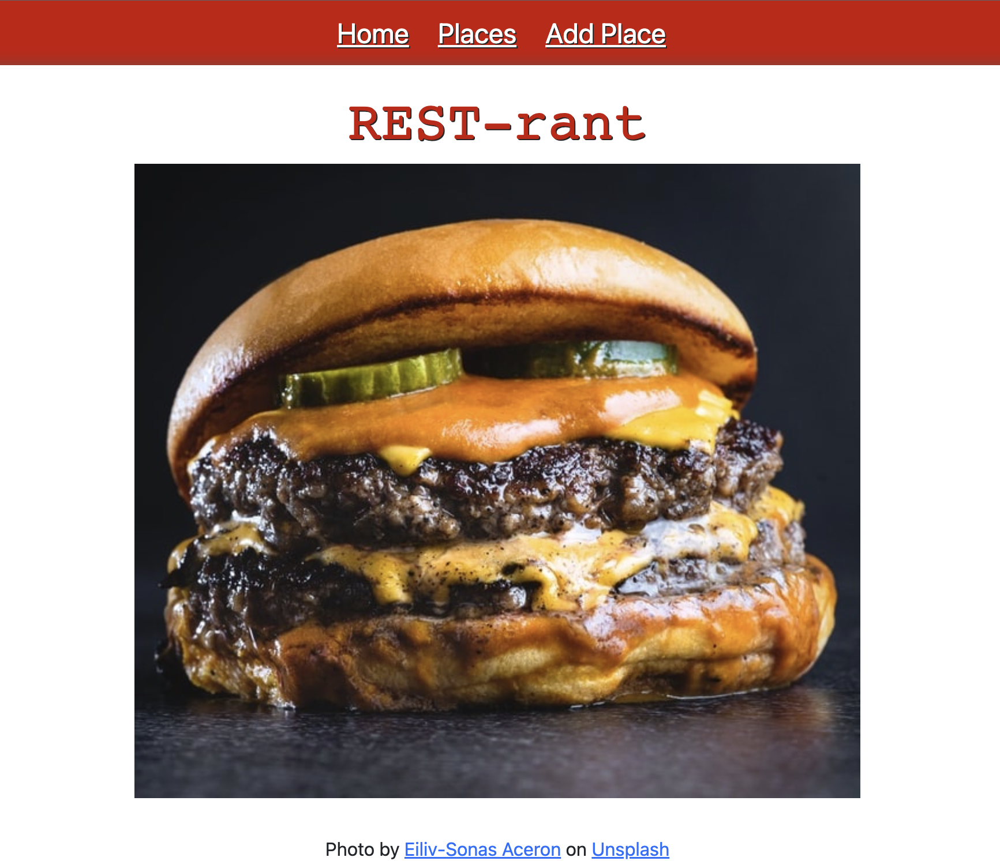

# Project REST-Rant

REST-Rant is a resturant rating app where users can upload images of resturants the have visted. The user can also rate and leave their review of those restaurants. Users are able to edit any details they posted about the resturant such as the name, location, year found, and type of cuisines served at the resturant. The user can also delete the entire post if desired.    

**ran on **localhost:3000**

## Installations 
### Node on Mac
- Install Homebrew first
  - On the Terminal, type xcode-select --install
  - Go to [Homebrew](https://brew.sh/) homepage and copy link
  - Go back to your terminal and paste from your clipboard with the keyboard shortcut Command **+ V**, then press Enter
  - Now that we have Homebrew installed, we can use the brew command in the terminal. Type the command **brew install** node and then press Enter

- Installing Node in terminal
  - Type the command **sudo apt install nodejs** and then press Enter
  - Type the command **sudo apt install npm** and then press Enter
  - Enter the command **npm -v** to verify npm was installed

### MongoDB Community Edition on Mac
link to install on Mac [MongoDB](https://www.mongodb.com/docs/manual/tutorial/install-mongodb-on-os-x/)
- When you reach and run the brew services list command in the terminal, you are finished with the installation and do not need to follow the remaining instructions.
- After running this command, make sure you see mongodb-community started.

### MongoDB Compass
link to install [Compass](https://www.mongodb.com/docs/compass/master/install/)

## API's
**Mongoose, React** and **Express** 

## Routes

| Method |    Path                     | Purpose     |
| :----: | :---------:                 | :---------: |
| GET    | /                           | Home page |
| GET    | /places                     | Places index page|
| POST   | /places                     | Create new place |
| GET    | /places/new                 | Form page for creating a new place |
| GET    | /places/:id                 | Details about a particular place |
| PUT    | /places/:id                 | Update a particular place |
| GET    | /places/:id/edit            | Form page for editing an existing place |
| DELETE | /places/:id                 | Delete a particular place |
| POST   | /places/:id/rant            | Create a rant (comment) about a particular place |
| DELETE | /places/:id/rant/:rantid    | Delete a rant (comment) about a particular place |
| GET    |  *                          | 404 page (matches any route not defined above) |

Places

| Field     | Type     |
| :-------  | :------: |
| Name      | string   |
| City      | string   |
| State     | string   | 
| Cuisines  | string   |
| Pictues   | string   |